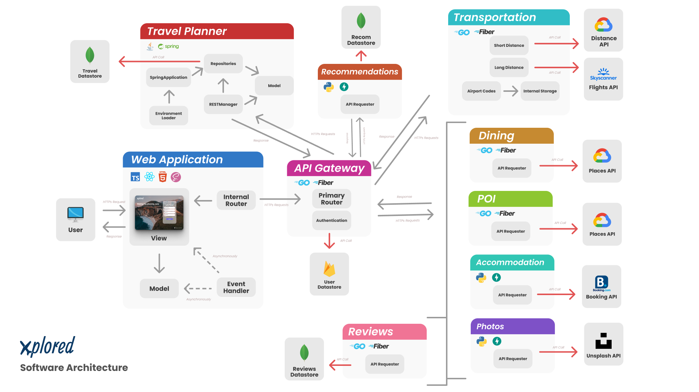

  
         

---

## 

---

# SENG 401 Software Architecture - Travel Planner

**Course:** SENG 401: Software Architecture

**Section:** L01/L02

**Group:** 9

**Semester:** Winter 2022

---

**Authors:** Robert Brown, Risat Haque, Alexis Hamrak, Dylan Wheeler, Nicholas Knapton, Brooke Kindleman & Amnah Hussain

---

## What is xplored?

---

The purpose of xplored is to allow users to make and update travel plans for future trips they will be going on. Our application will allow users to search travel websites in order to store and organize the plans they make. By collecting this information for their trips into one easily accessible and simple-to-use place, we will create a more relaxing experience for our users.

---

### **Prerequisites (Development)**

---

For development purposes, you must have the latest version of Docker installed.

- [Docker Windows](https://docs.docker.com/desktop/windows/install/)
- [Docker Linux](https://docs.docker.com/engine/install/ubuntu/)
- [Docker MAC](https://docs.docker.com/desktop/mac/install/)

---

### **Running The Program (Development)**

The Xplored project utilizes a containerized approach for microservices. In the deployed implementation each microservice has it's own container which is then networked with the gateway container. This means that only the gateway container will be exposed when the project is hosted.

## Deploying the Application

The deployment of the application is completed using `docker-compose` which aggregates each container and connects them. If your `.env` is properly configured in the root directory the entire application can be ran using the following command in the project root:

```bash
$ docker-compose -f Docker/docker-compose.yml up --build
```

## Developing the Application

The development version of the application can be ran with the following command from the root folder:

```bash
$ docker-compose -f Docker/docker-compose-dev.yml up --build
```

## Building Individual Containers

To build an individual container navigate to the root project folder and run the following command:

```bash
$ docker build -t <container tag> -f <path to docker file> .
```

## Running Individual Containers

To run an individual container for a microservice ensure that the the `.env` file exists in the parent folder. Once the Docker image is built it can be ran with the following command:

```bash
$ docker run -d -p <app port>:<local port> <container tag>
```

_Note:_ this will run your container in detached mode (i.e. in the background). Omitting the `-d` flag in the above command will show the output of the container in your current terminal.

---

## **Requirements:**

---

1. User can register/login into the system.
2. User can manage trips and events.
3. User can drag and drop a event into the trip planner.
4. User can view points on a map.
5. Determine directions (by Driving, Transit, Cycling & Walking) and distances between 2 locations.
6. Get possible flights between location.
7. Find suitable dining options in a given radius with either the name of the restaurant or a keyword.
8. Filter dining options based on cuisine, special food, or category.
9. Registered users can add reviews for other users to see.
10. Users can browse through a list of user-created reviews.
11. Find POI based on address and radius with given keyword.
12. User can request for a list of hotels based on various price, location, and ratings.
13. User can request recommendations for different countries and cities.
14. Request for photos for theming.

---

### **Software Architecture Diagram**

---

## 

### **Code implementation**

---

The code implementation is found in this git repository.

---

## Contributing

---

All source code for the project will be contained within this GitHub repository. Branch control is maintained and reviewers are required before merging pull requests into main.

Our git tree requires linear history, so all pull requests should be rebased if there are any conflicts.

## Naming conventions for commits and pull requests should follow the [Convectional Commits](https://www.conventionalcommits.org/en/v1.0.0/) standards.

### **License**

---

[MIT](https://choosealicense.com/licenses/mit/)
