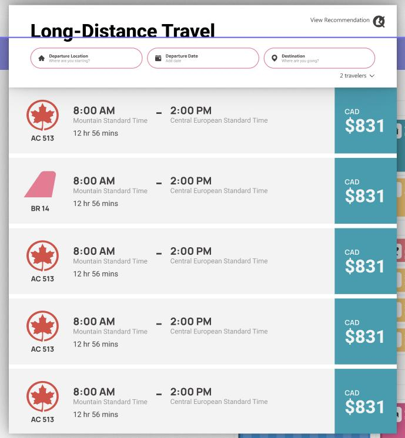

# Official *Xplore* User Guide

## Getting Started

To use *Xplore*, you will need to be logged in with a valid account. If you don't have a valid account or you have not logged in prior to accessing *Xplore*, you will be redirected to the the login page and asked to enter your username and password.

> **Tip!** Ensure your brower is set to accept cookies so you remain logged in throughout your session using *Xplore*

### Making An Account

Making an account can be done at the *Sign Up page* (below). To make an account, you'll need to put in an email that will act as your username, and create a password. Make sure both password fields match, or your account won't be created and you'll be asked to enter your information again.

Once you're signed up, you'll need to navigate to the Login page. This can be done by clicking the link in the top right corner of the screen. Then, follow the instructions below for logging in.

### Logging In

To login, ensure you are on the Login page (below), not the Sign up page.

To log in, enter the email you used to sign up for your account as your username, and enter your password. Upon authentication you will be automatically redirected to the *Xplored* home page to plan your trips.

----

## Managing Your Trips

To manage your trips, ensure you are on the [*Xplore homepage*](www.ADDRESSHERE.com). If you aren't, be sure to follow the [guide to getting started](#getting-started).

All trip management is done from the *Xplore* homepage (below)

### Adding a New Trip

To add a trip, click the plus button beside the trips dropdown (below)

In the popup that appears, enter the name of your new trip and click 'Add Trip' (below) to create the trip.

### Moving Between Trips

If you have multiple trips created, you will need to move between them to add events to a specific trip.

To move between trips, use the dropdown menu in the upper left corner of the homepage and select the trip you wish to access.

 Allow *Xplored* a moment to load all of your events and make sure your trip is ready to go.

## Adding An Event

To add an event, first select the type of event you want to add from the top navigation bar

 Available types are flights, land-travel, dining, accomodation, and points of interest.

Once you've selected a your event type, click on the chevron icon (below)found on the left side of the home page.

 

 A popup will appear on the left hand side, with space for you to input the your desired search criteria.

 If the popup contains a 'Search' button in the upper section, it will need to be clicked for your search to be submitted. If not, your results are being searched for as you're typing and will be available when you're finished entering your criteria.

Results from both kinds of searches will be found below the search bar, still within the popup.

 Click and drag the event you want into your calendar. Don't worry if you do not drag it to the exact spot you want, the booking time for your event can be changed later.

>**Tip!** Flight events will be automatically placed at the time the flight is scheduled for. Flights cannot be rescheduled.

## Changing an Event

For all events, except flight events, details of the event can be changed in two ways -- moving the event and changing the duration of the event.

### Moving an Event

To move an event, simply click on the event you want to move and drag it to the new desired spot. The event details will be automatically saved by *Xplored* for you to view again later, as soon as you place the event in its new spot

### Changing the Duration of An Event

To change the duration of an event, hover of the bottom of the event until you see a bar appear, indicating you can resize it. Then, click and drag the bar until the event has been changed to your desired duration. After the event duration has been changed, the new event details will be saved by *Xplored* automatically.

>**Tip!** Event durations automatically snap to the next half hour increment, even if the event ends slighty before.

## Deleting Events

If you ever want to remove an event, you can do so by clicking the small 'x' button the event you want to remove. It will be automatically removed from your travel planner and *Xplored* will update your saved events to no longer include it in your calendar.

## Viewing the Map

On all event type pages, a map can be viewed so you can visualize the locations of your events and plan your trip accordingly.

To view the map, navigate to the event type page you wish to view locations for, and click on the map icon located on the floating switch, located on the right side of the home page.

 A map will appear, showing you where your event takes place and will have markers to show you where the nearest locations that match your events are.

 

>**Tip!** You can move the map using the command 'Ctrl+scroll' and can move around the map by clicking and dragging where you want to go.

Please note that not all possible events matching yours will be shown -- only those in the area near your viewing-range will be visible. If the map is moved, events matching yours that are now within your viewing-range will appear.

To switch back to the events in your travel planner, click the calendar icon on the floating switch. Your travel planner will replace the map on the home page and you will be able to see the events again.

## Changing Dates

By default, *Xplored* will open your travel plan to the week containing the start of the first event in your planner. If you don't have any events in your travel planner for that trip, *Xplored* will open to the current week.

To change travel planner's week, use the forward and backwards buttons found in the purple navigation bar, just above the calendar. Clicking the left pointing arrow will move the calendar to the previous week and clicking the right arrow will move the calendar to the next week.

## Logging Out

When you want to log out, just click the 'Log Out' button located in the top right corner of the travel planner. *Xplored* will automatically log you out and return you to the login page, ready for you to log back in the next time you want to access the travel planner.

> **Tip!** You will not be able to access any *Xplored* services if you aren't currently logged in.
